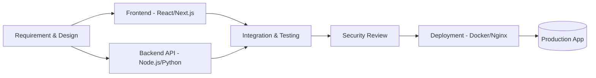

<div align="center">


<br>

<a href="https://github.com/rendikaangesti">

</a>

<br><br>


</div>


## 🧬 `whoami`

```yaml
name: Rendika Angesti
alias: DjoeraganCyber
role: [Full-Stack Developer, Backend Engineer, System Architect]
soft_skills: [Cybersecurity Awareness, Problem Solving, Client Communication]
company: Djoeragan Cyber — IT Solutions & Custom Software Partner
location: Indonesia 🇮🇩 → serving clients worldwide 🌍
mission: "Build software that is fast, elegant, and reliable."
contact:
  email: rendikaangesti4@gmail.com
  whatsapp: "+62 895-3235-79191"
  instagram: "@rendikaangestii"
```


## ⚡ Tech Stack

<div align="center">


<br><br>


</div>

<div align="center">

**Soft skill pendukung:** 

</div>


## 🎯 Featured Projects

<table>
<tr>
<td width="50%">

### 🌐 Web & API Development
Membangun aplikasi web full-stack — dari perancangan database, REST API, hingga antarmuka pengguna yang responsif.

`React` `Next.js` `Node.js` `PostgreSQL`

</td>
<td width="50%">

### 🔎 [APLIKASI-SCANNING-KERENTANAN-WEBSITE](https://github.com/rendikaangesti/APLIKASI-SCANNING-KERENTANAN-WEBSITE)
Tool pemindai kerentanan web & API dengan live audit terminal — proyek open-source yang menunjukkan pemahaman keamanan aplikasi sebagai bagian dari proses development.

`Python` `Security` `DAST`

</td>
</tr>
</table>


## 🗺️ How I Build Software



<sub>Security review masuk sebagai tahap tambahan berkat latar belakang cybersecurity — bukan fokus utama, tapi nilai tambah di setiap proyek.</sub>


## 📊 Live Metrics

<div align="center">


</div>

## 🏆 Trophy Case

<div align="center">

</div>

## 🐍 Contribution Snake

<div align="center">


<sub>⬆️ Aktifkan GitHub Action "Snake" resmi (platane/snk) agar animasi ini otomatis ter-generate dari commit Anda.</sub>
</div>


## 🤝 Djoeragan Cyber — Services

<div align="center">

| 💻 Full-Stack Development | 🌐 API Engineering | ⚙️ System Architecture | 🔐 Security-Aware Consulting |
|:---:|:---:|:---:|:---:|
| Web & mobile-ready apps | REST/GraphQL APIs | Scalable backend design | Secure-by-design guidance |

</div>

<div align="center">

### 📡 Connect With Me

<a href="https://wa.me/62895323579191"></a>
<a href="mailto:rendikaangesti4@gmail.com"></a>
<a href="https://instagram.com/rendikaangestii"></a>

<br><br>

⭐ **"First, solve the problem. Then, write the code." — John Johnson**

</div>


