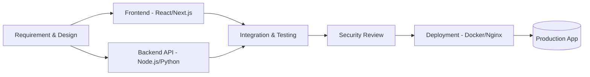

<div align="center">



<br>

<a href="https://github.com/rendikaangesti">

</a>

<br><br>


<br><br>

<a href="#-about-me">About</a> •
<a href="#-tech-stack">Tech Stack</a> •
<a href="#-featured-projects">Projects</a> •
<a href="#%EF%B8%8F-how-i-build-software">Workflow</a> •
<a href="#-github-stats">Stats</a> •
<a href="#-lets-work-together">Contact</a>

</div>


## 👋 About Me

I'm **Rendika Angesti**, a Full-Stack Developer based in Indonesia, working with clients around the world through **Djoeragan Cyber** — my software & IT solutions studio. I enjoy taking a product from a rough idea to a working, deployed application: designing the database, building the API, wiring up the frontend, and making sure the whole thing actually holds up in production.

Before focusing full-time on full-stack development, I spent time in cybersecurity — and that background didn't disappear, it just changed roles. Instead of being my main job title, it's now a **soft skill** baked into how I write code: I think about input validation, auth flows, and edge cases a little more carefully than most, because I've seen what happens when nobody does.

```yaml
name: Rendika Angesti
alias: DjoeraganCyber
role: [Full-Stack Developer, Backend Engineer, System Architect]
soft_skills: [Cybersecurity Awareness, Problem Solving, Client Communication, Fast Learning]
company: Djoeragan Cyber — IT Solutions & Custom Software Partner
location: Indonesia 🇮🇩 → serving clients worldwide 🌍
currently_building: A vulnerability-scanning SaaS platform
currently_learning: Advanced system design & distributed architectures
mission: "Build software that is fast, elegant, and reliable."
fun_fact: "I debug faster with coffee, but I ship either way."
contact:
  email: rendikaangesti4@gmail.com
  whatsapp: "+62 895-3235-79191"
  instagram: "@rendikaangestii"
```

### 🎯 What I Actually Do

| | |
|---|---|
| 🖥️ **Frontend** | Building responsive, accessible interfaces with React & Next.js |
| ⚙️ **Backend** | Designing REST APIs, authentication systems, and business logic |
| 🗄️ **Database** | Modeling relational (PostgreSQL) and document (MongoDB) data |
| 🚀 **DevOps** | Containerizing and deploying apps with Docker & Nginx |
| 🔐 **Security Layer** | Applying secure-by-design principles across the stack |
| 🤝 **Client Work** | Translating business requirements into technical specs |


## ⚡ Tech Stack

<div align="center">

### Languages & Core


### Frontend


### Backend


### Database & Infra


### Tools


</div>

<br>

<div align="center">


</div>

<div align="center">

**Soft skill pendukung:**   

</div>


## 🎯 Featured Projects

<table>
<tr>
<td width="50%" valign="top">

### 🌐 Web & API Development
Full-stack web applications — from database schema and REST API design to responsive, production-ready frontends.

**Highlights:**
- Clean, RESTful API architecture
- Responsive UI with React/Next.js
- Authentication & role-based access
- Dockerized deployment pipeline

`React` `Next.js` `Node.js` `PostgreSQL`

</td>
<td width="50%" valign="top">

### 🔎 [APLIKASI-SCANNING-KERENTANAN-WEBSITE](https://github.com/rendikaangesti/APLIKASI-SCANNING-KERENTANAN-WEBSITE)
An open-source Web & API vulnerability scanner with a live security audit terminal and modular DAST suite — a side project that shows application security as part of the development process, not the main focus.

**Highlights:**
- Real-time scan output
- Modular, plug-and-play scan rules
- MIT Licensed, open for contributions

`Python` `Security` `DAST`

</td>
</tr>
</table>

<div align="center">

</div>


## 🗺️ How I Build Software



<sub>Security review masuk sebagai tahap tambahan berkat latar belakang cybersecurity — bukan fokus utama, tapi nilai tambah di setiap proyek.</sub>

### 📋 My Development Principles

<table>
<tr><td>

**1. Ship working software, then iterate**
No project is perfect on the first pass — get something functional in front of users, then refine.

</td></tr>
<tr><td>

**2. Readable code beats clever code**
Future-me (and whoever inherits the codebase) should be able to understand it without a decoder ring.

</td></tr>
<tr><td>

**3. Security is a habit, not a checklist**
Input validation and sane defaults go in from day one, not bolted on at the end.

</td></tr>
<tr><td>

**4. Communicate early, communicate often**
Most project failures are communication failures, not technical ones.

</td></tr>
</table>


## 🧭 Journey / Timeline

```text
2022 ─┬─ Started learning programming fundamentals (Python, JS)
      │
2023 ─┼─ Went deep into cybersecurity: pentesting, vulnerability research
      │
2024 ─┼─ Founded Djoeragan Cyber — IT Solutions & Custom Software Partner
      │
2025 ─┼─ Shifted focus toward full-stack development (React/Next.js/Node.js)
      │  Built and open-sourced APLIKASI-SCANNING-KERENTANAN-WEBSITE
      │
2026 ─┴─ Currently: building full-stack products, security-aware by habit
```


## 📊 GitHub Stats

<div align="center">


</div>

## 🏆 Trophy Case

<div align="center">

</div>

## 🐍 Contribution Snake

<div align="center">


<sub>⬆️ Aktifkan GitHub Action "Snake" resmi (platane/snk) agar animasi ini otomatis ter-generate dari commit Anda.</sub>
</div>


## ❓ FAQ

<details>
<summary><b>Apa layanan utama Djoeragan Cyber?</b></summary>
<br>
Full-stack web & API development — dari perancangan hingga deployment. Cybersecurity tetap menjadi nilai tambah di setiap proyek, bukan layanan terpisah.
</details>

<details>
<summary><b>Bisa kerja remote dengan klien luar negeri?</b></summary>
<br>
Bisa. Komunikasi dilakukan lewat email/WhatsApp/Instagram, dan seluruh proses development bisa dipantau lewat repository & progress report berkala.
</details>

<details>
<summary><b>Apa tech stack yang paling sering dipakai?</b></summary>
<br>
React/Next.js di frontend, Node.js atau Python di backend, PostgreSQL/MongoDB untuk database, dan Docker untuk deployment.
</details>

<details>
<summary><b>Apakah proyek open-source bisa dikontribusikan?</b></summary>
<br>
Ya — <a href="https://github.com/rendikaangesti/APLIKASI-SCANNING-KERENTANAN-WEBSITE">APLIKASI-SCANNING-KERENTANAN-WEBSITE</a> terbuka untuk pull request di bawah lisensi MIT.
</details>


## 🤝 Let's Work Together

<div align="center">

| 💻 Full-Stack Development | 🌐 API Engineering | ⚙️ System Architecture | 🔐 Security-Aware Consulting |
|:---:|:---:|:---:|:---:|
| Web & mobile-ready apps | REST/GraphQL APIs | Scalable backend design | Secure-by-design guidance |

</div>

<div align="center">

### 📡 Connect With Me

<a href="https://wa.me/62895323579191"></a>
<a href="mailto:rendikaangesti4@gmail.com"></a>
<a href="https://instagram.com/rendikaangestii"></a>

<br><br>

⭐ **"First, solve the problem. Then, write the code." — John Johnson**

<br><br>

<sub>Thanks for stopping by — if this profile gave you an idea or helped you out, a ⭐ on my repos goes a long way.</sub>

</div>


