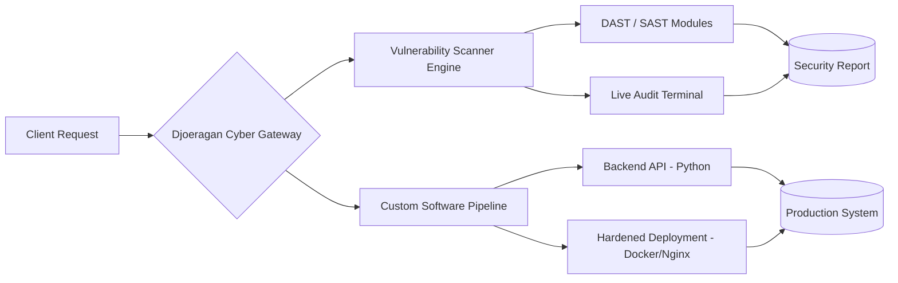

<div align="center">


<br>

<a href="https://github.com/rendikaangesti">

</a>

<br><br>


</div>


## 🧬 `whoami`

```yaml
name: Rendika Angesti
alias: DjoeraganCyber
role: [Penetration Tester, Backend Engineer, Security Architect]
company: Djoeragan Cyber — IT Solutions, Custom Software & Cybersecurity Partner
location: Indonesia 🇮🇩 → serving clients worldwide 🌍
mission: "Build systems that are fast, elegant, and unbreakable."
contact:
  email: rendikaangesti4@gmail.com
  whatsapp: "+62 895-3235-79191"
  instagram: "@rendikaangestii"
```


## ⚡ Tech Arsenal

<div align="center">


<br><br>


</div>


## 🎯 Flagship Build

<table>
<tr>
<td width="60%">

### 🔎 [APLIKASI-SCANNING-KERENTANAN-WEBSITE](https://github.com/rendikaangesti/APLIKASI-SCANNING-KERENTANAN-WEBSITE)

> **Enterprise-grade Web & API Vulnerability Scanner** — Live Security Audit Terminal + Modular DAST Suite.

- ⚡ Real-time DAST engine, OWASP Top 10-aligned
- 🖥️ Live terminal-style audit streaming
- 🧩 Plug-and-play scan modules
- 🔓 Open-source · MIT Licensed

`Python` `Security` `DAST` `Automation`

</td>
<td width="40%">

</td>
</tr>
</table>


## 🖥️ Live Security Terminal

```bash
┌──(rendika@djoeragancyber)-[~/security-ops]
└─$ ./scan_target.sh --mode=deep --report=live

[+] Initializing DAST engine...............................  OK
[+] Loading OWASP Top 10 ruleset............................  OK
[+] Crawling application surface............................  312 endpoints found
[+] Testing for SQLi / XSS / SSRF / IDOR....................  IN PROGRESS
[+] Checking TLS configuration & headers....................  PASSED
[+] Generating executive security report....................  DONE ✔

>>> Scan completed in 42.7s — 0 critical, 2 medium, 5 informational
```


## 🗺️ Service Architecture




## 🎖️ Security Scorecard

<div align="center">

| Category | Rating |
|---|---|
| 🔐 Application Security | ⭐⭐⭐⭐⭐ |
| 🛡️ Network Hardening | ⭐⭐⭐⭐⭐ |
| ⚡ Response Time | ⭐⭐⭐⭐☆ |
| 📋 Compliance Readiness | ⭐⭐⭐⭐⭐ |
| 🤝 Client Satisfaction | ⭐⭐⭐⭐⭐ |

</div>

## 📊 Live Metrics

<div align="center">


</div>

## 🏆 Trophy Case

<div align="center">

</div>

## 🐍 Contribution Snake

<div align="center">


<sub>⬆️ Aktifkan GitHub Action "Snake" resmi (platane/snk) agar animasi ini otomatis ter-generate dari commit Anda.</sub>
</div>


## 🤝 Djoeragan Cyber — Services

<div align="center">

| 🔐 Pentest | 🛡️ Vuln Scan | 💻 Custom Dev | 📋 Consulting |
|:---:|:---:|:---:|:---:|
| Web, API & Network | Automated DAST/SAST | Tailored backend apps | Hardening & compliance |

</div>

<div align="center">

### 📡 Connect With Me

<a href="https://wa.me/62895323579191"></a>
<a href="mailto:rendikaangesti4@gmail.com"></a>
<a href="https://instagram.com/rendikaangestii"></a>

<br><br>

⭐ **"Security is not a product, it's a process." — Bruce Schneier**

</div>


