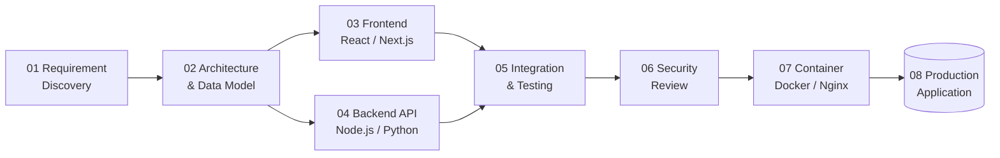

<div align="center">

<!-- HERO -->
<a href="https://github.com/rendikaangesti">
  
</a>

<a href="https://github.com/rendikaangesti">
  
</a>

<br>

<a href="https://github.com/rendikaangesti">
  
</a>

<br><br>

<a href="https://github.com/rendikaangesti">
  
</a>
<a href="https://github.com/rendikaangesti?tab=followers">
  
</a>
<a href="https://github.com/rendikaangesti">
  
</a>
<a href="https://www.google.com/maps/search/Indonesia">
  
</a>

<br><br>

<a href="#-about-me">About</a>
&nbsp;•&nbsp;
<a href="#-what-i-build">What I Build</a>
&nbsp;•&nbsp;
<a href="#-tech-stack">Tech Stack</a>
&nbsp;•&nbsp;
<a href="#-featured-projects">Projects</a>
&nbsp;•&nbsp;
<a href="#-engineering-workflow">Workflow</a>
&nbsp;•&nbsp;
<a href="#-github-analytics">Analytics</a>
&nbsp;•&nbsp;
<a href="#-lets-work-together">Contact</a>

<br><br>


</div>

## 🧠 About Me

Hi, I'm **Rendika Angesti** — a Full-Stack Developer based in Indonesia, building software through **Djoeragan Cyber**, my IT solutions & custom software studio.

I like turning rough requirements into something that can actually ship: **database design → backend/API → frontend → testing → deployment**.

My earlier cybersecurity experience still shapes how I engineer software today. I naturally pay attention to **input validation, authentication, authorization, edge cases, and secure defaults** without making security the entire product story.

### `profile.yaml`

```yaml
name: Rendika Angesti
alias: DjoeraganCyber

roles:
  - Full-Stack Developer
  - Backend Engineer
  - System Architect

company: Djoeragan Cyber
focus:
  - Production-ready web applications
  - REST APIs
  - Scalable backend architecture
  - Secure-by-design engineering

location: Indonesia
serving: Worldwide

currently_building:
  - Vulnerability-scanning SaaS platform

currently_learning:
  - Advanced system design
  - Distributed architectures

mission: "Build software that is fast, elegant, and reliable."
```

---

## ⚡ What I Build

<table>
<tr>
<td width="50%" valign="top">

### 🖥️ Frontend Engineering

Responsive and accessible interfaces designed to feel fast, clean, and intentional.

**Focus**
- React & Next.js
- Responsive layouts
- Reusable UI patterns
- API-driven interfaces
- Performance-minded delivery

</td>
<td width="50%" valign="top">

### ⚙️ Backend Engineering

Business logic and APIs designed around maintainability, clear contracts, and production usage.

**Focus**
- Node.js / Express
- Python / Django / FastAPI
- REST API architecture
- Authentication & authorization
- Validation & edge cases

</td>
</tr>

<tr>
<td width="50%" valign="top">

### 🗄️ Data & Infrastructure

From schema design to containerized delivery.

**Focus**
- PostgreSQL
- MongoDB
- Redis
- Docker
- Nginx
- Linux

</td>
<td width="50%" valign="top">

### 🔐 Security-Aware Development

Cybersecurity experience translated into day-to-day engineering habits.

**Focus**
- Secure input handling
- Auth flow awareness
- Defensive defaults
- Security review
- Risk-aware implementation

</td>
</tr>
</table>

---

## 🧰 Tech Stack

<div align="center">

### Languages & Core


### Frontend


### Backend


### Database & Infrastructure


### Engineering Tools


</div>

<br>

<div align="center">


<br>


</div>

---

## 🚀 Featured Projects

<table>
<tr>
<td width="50%" valign="top">

### 🌐 Web & API Engineering

Full-stack applications built from the ground up — from **data modeling and API design** to **responsive frontend** and **containerized deployment**.

**Highlights**
- RESTful API architecture
- React / Next.js interfaces
- Authentication & role-based access
- Dockerized deployment pipeline
- Production-oriented engineering

`React` `Next.js` `Node.js` `PostgreSQL`

</td>

<td width="50%" valign="top">

### 🔎 APLIKASI-SCANNING-KERENTANAN-WEBSITE

Open-source Web & API vulnerability scanner with a live security audit terminal and modular DAST-style scanning suite.

**Highlights**
- Real-time scan output
- Modular scan rules
- Open for contributions
- MIT Licensed
- Security-aware engineering showcase

`Python` `Security` `DAST`

<br>

<a href="https://github.com/rendikaangesti/APLIKASI-SCANNING-KERENTANAN-WEBSITE">
  
</a>

</td>
</tr>
</table>

---

## 🏗️ Engineering Workflow



<div align="center">

> **Security review is part of the engineering flow — not an afterthought.**

</div>

### 📐 Development Principles

| Principle | What it means |
|:--|:--|
| **01 — Ship working software** | Deliver a functional version, then iterate with feedback. |
| **02 — Readable beats clever** | Code should remain understandable months later. |
| **03 — Security is a habit** | Validation and sane defaults start from day one. |
| **04 — Communicate early** | Clear requirements prevent more problems than clever code can. |

---

## 🗺️ Journey

```text
2022  ──► Started learning programming fundamentals
          Python • JavaScript

2023  ──► Went deeper into cybersecurity
          Pentesting • Vulnerability research

2024  ──► Founded Djoeragan Cyber
          IT Solutions • Custom Software

2025  ──► Shifted focus toward full-stack engineering
          React • Next.js • Node.js
          Built & open-sourced vulnerability scanner

2026  ──► Current focus
          Full-stack products
          System design
          Security-aware engineering
```

---

## 📊 GitHub Analytics

<div align="center">

<a href="https://github.com/rendikaangesti">
  
</a>

<a href="https://github.com/rendikaangesti">
  
</a>

<br>

<a href="https://github.com/rendikaangesti">
  
</a>

<a href="https://github.com/rendikaangesti">
  
</a>

</div>

---

## 🏆 Trophy Case

<div align="center">


</div>

---

## 🐍 Contribution Snake

<div align="center">


<br>

<sub>
Enable the <b>Snake</b> GitHub Action to generate this asset automatically from contributions.
</sub>

</div>

---

## ❓ FAQ

<details>
<summary><b>What does Djoeragan Cyber focus on?</b></summary>

<br>

Full-stack web & API development — from architecture and implementation to deployment. Cybersecurity remains a security-aware engineering advantage throughout the development process.

</details>

<details>
<summary><b>Can you work with international clients?</b></summary>

<br>

Yes. Remote collaboration can be handled through email, WhatsApp, and Instagram, with development progress tracked through repositories and regular updates.

</details>

<details>
<summary><b>What stack do you use most often?</b></summary>

<br>

React / Next.js for frontend, Node.js or Python for backend, PostgreSQL / MongoDB for data, and Docker for deployment.

</details>

<details>
<summary><b>Can people contribute to the open-source scanner?</b></summary>

<br>

Yes. The repository is open for pull requests under the MIT license.

</details>

---

## 🤝 Let's Work Together

<div align="center">

| 💻 Full-Stack Development | 🌐 API Engineering | ⚙️ System Architecture | 🔐 Security-Aware Engineering |
|:---:|:---:|:---:|:---:|
| Web & mobile-ready apps | REST APIs & integrations | Scalable backend design | Secure-by-design guidance |

<br>

### 📡 Connect

<a href="https://wa.me/62895323579191">
  
</a>
<a href="mailto:rendikaangesti4@gmail.com">
  
</a>
<a href="https://instagram.com/rendikaangestii">
  
</a>

<br><br>

> **“First, solve the problem. Then, write the code.” — John Johnson**

<br>

<sub>
Thanks for stopping by. A ⭐ on a repository helps keep the work moving.
</sub>

</div>


